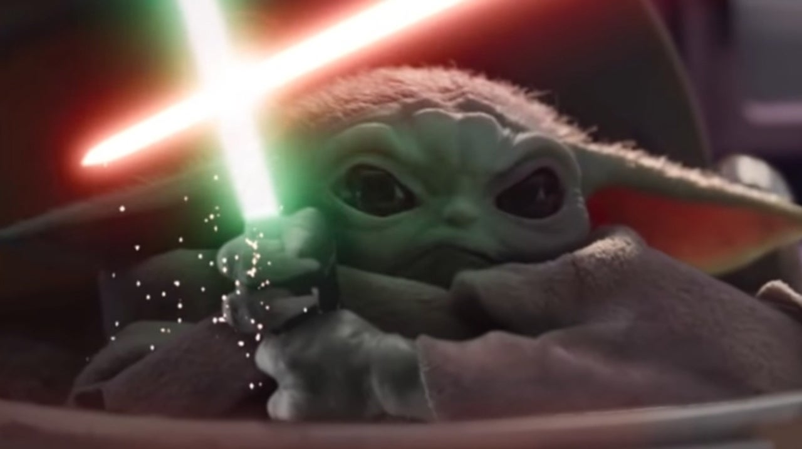

```{r setup, include=FALSE}
knitr::opts_chunk$set(echo = TRUE)
```

<br>  

### WEEK 3
10min - print up circles, do shoe test, chat

10 min - FUN experiment

10min - lecture ch 3

10min - break

10min - lecture ch4

10min - Qs

10min - OPTIONAL - plant-animal show and tell


<br>  

### WEEK 4
5min wait for people

10min experiment chat

10min ch7

10min break with James

10min ch8

10min lab talk


<br>  

### WEEK 5
TODAY IS A DUE DATE :)
So, I will be efficient. haha.

5min chance for people to join
5min Q & A with TAS
10min expt fun
10min Ch5 Deck
10min break
10min CH6 deck
15mins Q & A with TAS

<br>  

### WEEK 6
5min chill out and look at Biggie
5min lab chat and reminder
10min of Gritty experimental fun
10min CH9
10min break
10min CH10

<br>  

### WEEK 8
5min chat

5min intro to Among Us

20min experiment  with Among Us

5min discussion about reverse-engineering hypothesis and predictions

10min break

10 min review of ten simple rules for awards paper

10 min break-out rooms to highlight rules usefulness from an ED philosophy
link: https://forms.gle/hvfhSfZL1Mrt8yEH7

<br>  

### Week 9 & 10
Among us

BIG picture for lectures

Ten simple rules x2

Break

Scicomm

<br>  

### Week 11
15min We need data: Among Us experiment  
25min grant clarification  
10min break to cogitate    
15min breakout for loose bit Qs addressed  

FAQS for grant  
How long/short (haha) can the plain language summary be?  
300 words    

Are you for marking for design or competitive grant writing?  
primarily design thinking and clarity (not the scientific novelty but the viability)    
How important is the idea?  
mild to moderate - designs that work win the race   


<br>  

### Week 12

10min [quick draw](https://quickdraw.withgoogle.com)
15min debrief deck  
20% insight, 80% practice for neurological change but we do grading 50-50% in this course  
10min break  
20min wrap up and support in data-design lab  




