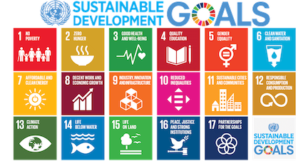

```{r setup, include=FALSE}
knitr::opts_chunk$set(echo = TRUE)
```
<br>

## Module 1  

### Readings  
We read [Experimental Design for the Life Sciences, Fourth Edition](https://global.oup.com/academic/product/experimental-design-for-the-life-sciences-9780198717355?cc=us&lang=en&) Chapters 1-10 together in the lecture and discuss.  

  
<br>

### Test  
**Memory**  
1. What is an indirect measure and why do we ever use them?  
2. Where do good scientific ideas come from and how does this relate to critical scientific thinking?  
3. What is pseudoreplication and what are two of the most common sources?  
4. Provide a plot illustrating Simpson's paradox for male versus female applications to a university.  
5. What is the difference between sensitivity and specificity in measurements?  
6. What is an effect size?  Define and provide an example.  
7. Recording and storing data from experiments also pose challenges, and you need to design these aspects in advance too.  Explain two challenges and list a solution for each.  
8. What is a within-subject design and why is it not pseudoreplication? In explaining why not, provide the solution.  
9. Define blind/masked procedures and explain the different kinds.  
10. Provide a table explaining the difference between Type I &II errors in the outcome of experiments.   

**Concepts**  
1. How do decide between two versus many levels for a given factor in designing an experiment? Use figures to show how you decide and provide a brief explanation in text form too.  Make a general recommendation on the most likely design to best capture variation across many levels whilst still estimating variation/protecting against drop-outs too.  
2. What is a hypothesis, provide a real world example, and explain the difference between a hypothesis and prediction.  
3. It is sometimes useful to unbalance replicates across groups or levels for ethical or practical reasons.  Provide a set of guidelines including a checklist of considerations for researchers.  Clearly explain and show when you want to unbalance in favour of controls versus treatments and the converse (so that both textbook and Lortie are correct).  
4. You have been hired to design an experiment.  Your employer is keen to do it well, but research costs money.  They want to do the best possible experiment but balance that against the cost of paying subjects in the experiment to test their new machine.  What are some general tools that you can use to decide on how the extent that you recommended to them to replicate?  This is a very real problem as sometimes employers/grants want to spend less on replication and you have to justify why you selected the number you did.  Explain the concepts and tools clearly to your employer.  Remember, they do not have infinite funds either so you have give them the evidence needed to justify whatever they can afford.  
5. It is easy for scientists to fall into the trap of randomizing everything and assuming this solves all problems.  Explain randomization from an experimental design perspective and how you would use it to design the sampling of an experiment with heterogeneity between groups of subjects and in applying the treatments.  

**Synthesis of best experimental design principles**  

1. You have some lovely fruit trees in your orchard, and it is important to you to protect your crop from pests.  Unlike some other growers, you prefer to not trap out the small mammals (squirrels & rodents) but need to keep the ripening fruit on the tree branches till harvest.  The animals can eat the fruit that falls to the ground.  You have read that metal flashing wrapped around the trunk prevents animals from climbing up.  You have $10,000 you were going to spend on advertising but want to spend on doing an experiment this year with flashing so that you can be organic and animal friendly when you advertise next year.  You have three major fruit orchards on your farm, each separated by a 1km, and you have noticed animal activity in all three locations.  The growing season is 6 months long, beginning in May and ending in October, and at each location you have approximately 300 trees.  The metal flashing is sold in rolls 10 ft wide and 100 feet long.  Each roll costs $1000.  You have 3 staff, part-time to help you set up experiment. All three locations have fruit trees that are even aged and approximately the same size at 25 feet tall with a trunk diameter at breast height of on average of 3 ft.  Please design experiment to determine if metal flashing wrapped around the trunk will work.  Also, determine whether the height of placement and width of flashing needed are important considerations.  Write a hypothesis, predictions, and the methods with a sketch to show outline of experiment as you are planning on sharing the find in in a local fruit grower publication for others within the region.  

2. You are managing a running race.  Design a ‘validation’ experiment to demonstrate that the system you have developed minimizes bias and inaccuracies.  You have a limited budget for equipment but many volunteers. In your design, also include best design principles for the volunteers too.  Develop a checklist you provide to them. Explain the design but also do a very clear schematic to show the validation design to the race officials to get your race Ontario Track and Field Certified.  You do not need a hypothesis and prediction for a validation protocol, but you do need the protocol to very clear and decouple bias from inaccuracy.  Ensure you also have redundancy and a checking system in place for races in case one system fails because these competitions are very important qualifying races for potentially professional athletes.  

3. You have decided to do some research contract work after your undergraduate before you make your big career decision.  You took an experimental design course and are now confident you can advertise yourself as an expert in design to help out companies.  You are also really into the physical training literature and sports.  You have secured your first contract with a really innovative gym called P3 that trains many pro-athletes including potential draft recruits for the NBA.  As part of the research by the gym, they test really novel training techniques including use of hi-res recordings, electronic muscle stimulation (EMS), and also transcranial direct-current stimulation (tDCS).  Both are basically forms of electrical stimulation of either the muscles or the brain directly and preliminary but accumulating research has shown both can have positive effects on performance.  They have hired you to help them use this really expensive equipment they purchased to train athletes but also collect data in a meaningful way to publish and establish their company (gym but they are branding it as a research clinic).  Show off what you know here from experimental design using the terms and ideas of avoiding psuedorep, within-subject measures, PPV, how to decide on replication levels, specificity in testing protocols, etc.  Remember however, all althletes are paying clients but return many times for training within a single season.  Assume they handle approximately 120 athletes pre-season before draft picks, each athlete can visit up to a dozen times over the course of 6 months, and your goal is to design an experiment that tests whether stimulation works.  Ensure you test frequency, contrast direct muscle versus brain stim, and whether you need to both.  They train only men 17-21 years but they can vary in height from 6ft upwards.  Provide a visual outline of the design as well to show to pitch your design to P3.  

4. The global goals are an inspiration. We need them. Design an experiment that can provide evidence of success after 5 years of hard work by a nation for just one of the 17 goals listed.  Other researchers will test the remaining goals so ensure your design has some elements of repeatability and that they can compare their findings to yours.
List your hypothesis, predictions, and include a description of your pilot experiment.   Do this in writing.  Clearly state how you are invoking best experimental design principles because your written full grant will be reviewed.  You also have to present this to the UN for funding as part of the application process (they want to see if you can also communicate and summarize complexity well).  You get only three slides and a few minutes to compete for the funding.  Prep three visuals to show during your proposal.  I recommend you do one figure showing the hypothesis and prediction clearly in a visual form, one figure showing the design, and one figure showing what you anticipate the outcome of the experiment will generate (i.e. a data visualization plot).  

   
<br>

5. VW likely failed to communicate clearly to the public about TDI cars.  Someone within the company programmed a cheat code that allows the car to pass aircare tests.  However, when driving, it produces 4-40x above acceptable emissions.  Design an experiment to determine the frequency that this cheat was applied to their TDI models (3 different models with TDI engines) for cars currently on the road, test if they are set to cheat including the amount they pollute, and the extent that the cheat activates in testing within each model (i.e. is their sensitivity in the cheat turning on).  To be clear, the cheat activates when the cars are put on rollers and only two wheels roll.  Develop a hypothesis, predictions, and a very clear design.  Include a visual sketch of the experimental design in addition to your description.  Anticipate the outcome of your testing by providing a set of data visualization figures from the experiment.  VW will likely challenge your findings no matter what you report so ensure you have a robust design you can defend by invoking the ‘best experimental design’ principles from your training.  


